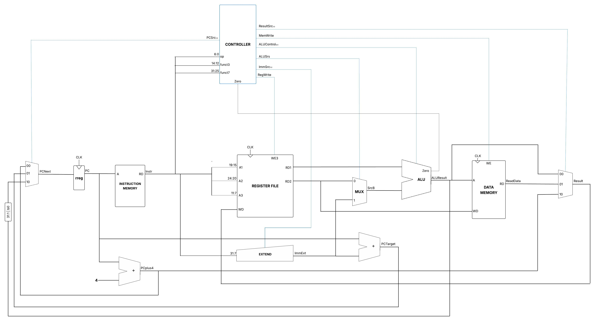
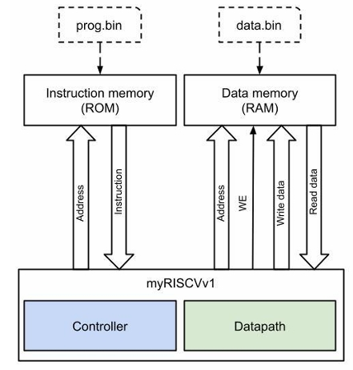
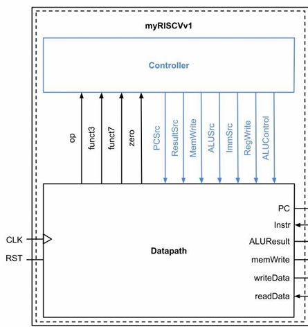
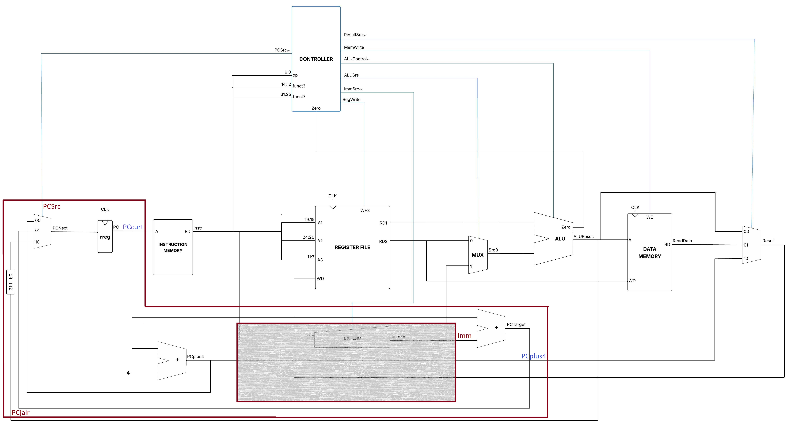
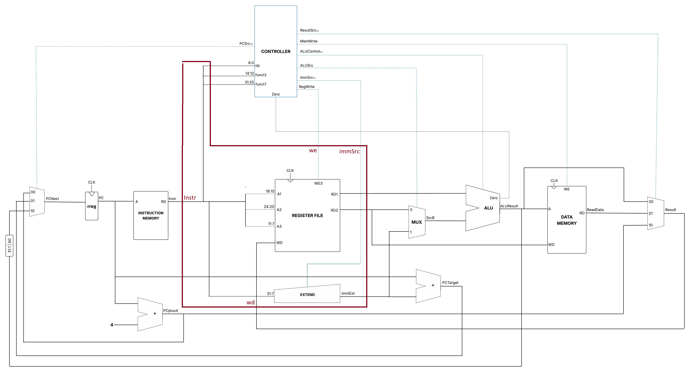
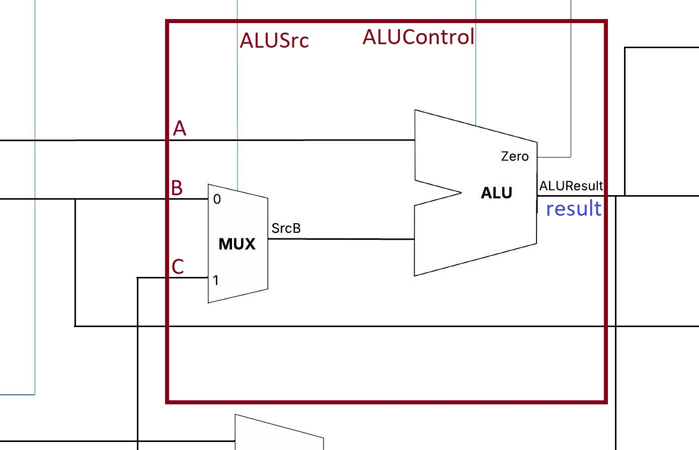

# **Processador myRISCVv1**
## INDICES
* [CRÉDITOS](#créditos)
* [ARQUITETURA](#arquitetura)
* [COMPONENTES](#componentes)
* [LISTA DE INSTRUÇÕES](#lista-de-instruções-base-que-o-processador-myriscvv1-comporta)
* [COMO USAR](#como-usar)
## CRÉDITOS

Este projeto tem como base o processador [RISC-V](https://riscv.org/) _single-cycle_, precisamente o _RV32I_ com _Immediate Encoding Variants_ ([_The RISC-V Instruction Set Manual Volume I: Unprivileged ISA_](https://lf-riscv.atlassian.net/wiki/spaces/HOME/pages/16154899/RISC-V+Technical+Specifications+Archive), v. 20240411, p. 2.3)

**Requisitos do projeto**:
[```docs```](https://github.com/PedroVentura21/myRV32Iv1/tree/master/docs)

**Disciplina:** Laboratório de Organização e Arquitetura de Computadores (CCMP0250) UNIVASF Campus Juazeiro 2025.1

**Discente desenvolvedor:** [Pedro Giovanni Ventura](https://github.com/PedroVentura21)

---

## ARQUITETURA
Na atual versão do repositório, o processador segue a seguinte arquitetura:


[link lucid](https://lucid.app/lucidspark/eb46b10a-157d-470d-b11e-74d35adcdb82/edit?invitationId=inv_302d3fba-00ef-4c7f-ba68-fc9a77d13eca)

## COMPONENTES
**Considerações:**
- Os componentes estão todos agrupados para melhor manutenção.
- Textos em vermelho são entradas (input);
- Textos em azul são saídas (output);
- quando tiver `indice (texto)`, interprete _`indice`_ como _`relação entre os componetes`_ e _`texto`_ como _`o nome dado ao instanciar o componente`_;
---

### 0. testbench

0 - [testbench.vhd](cod_vhdl/testbench.vhd)

### 1\.  Design

1.0 - [design.vhd](cod_vhdl/componentes/design.vhd)



fig 1: [arquitetura do design](cod_vhdl/componentes/arch_design.jpeg)

1.1 - Instruction Memory (`IM`)
* 1.1.0 - [rom.vhd](cod_vhdl/componentes/rom.vhd)
* 1.1.1 - [prog.bin](cod_vhdl/componentes/prog.bin)

1.2 - Data Memory (`DM`)
* 1.2.0 - [ram.vhd](cod_vhdl/componentes/ram.vhd)

1.3 - myRISCVv1 (`myRV`)



fig 2: [arq. do myRISCVv1](cod_vhdl/componentes/myRISCVv1/arch_myRISCVv1.jpeg)

* 1.3.0 - [myRISCVv1.vhd](cod_vhdl/componentes/myRISCVv1/myRISCVv1.vhd)
* 1.3.1 - [controller.vhd](cod_vhdl/componentes/myRISCVv1/controller.vhd) (`CONTROLLER`)
* 1.3.2 - Datapath (`DATAPATH`)
    * 1.3.2.0 - [datapath.vhd](cod_vhdl/componentes/myRISCVv1/datapath/datapath.vhd)
    * 1.3.2.1 - [mux332.vhd](cod_vhdl/componentes/myRISCVv1/datapath/mux332.vhd) (`MUX_3`)
    * 1.3.2.2 - ifetch (`IFE`)
        * 1.3.2.2.0 - [ifetch.vhd](cod_vhdl/componentes/myRISCVv1/datapath/ifetch/ifetch.vhd)
        

            fig 3: [arq. do ifetch](cod_vhdl/componentes/myRISCVv1/datapath/ifetch/arch_ifetch.jpg)

        * 1.3.2.2.1 - [rreg32.vhd](cod_vhdl/componentes/myRISCVv1/datapath/ifetch/rreg32.vhd)  (`PC`)
        * 1.3.2.2.2 - [addr32.vhd](cod_vhdl/componentes/myRISCVv1/datapath/ifetch/addr32.vhd) (`PLUS4`)
        * **obs.:** mux332 já adicionado (`MUX_1`)
    * 1.3.2.3 - idecoder (`ID`)
        * 1.3.2.3.0 - [idecoder.vhd](cod_vhdl/componentes/myRISCVv1/datapath/idecoder/idecoder.vhd)
        

            fig 4: [arq. do idecoder](cod_vhdl/componentes/myRISCVv1/datapath/idecoder/arch_idecoder.jpg)

        * 1.3.2.3.1 - [register.vhd](cod_vhdl/componentes/myRISCVv1/datapath/idecoder/register.vhd) (`REG_FILE`)
        * 1.3.2.3.2 - [extend.vhd](cod_vhdl/componentes/myRISCVv1/datapath/idecoder/extend.vhd) (`EXTEND`)
    * 1.3.2.4 - executer (`EX`)
        * 1.3.2.4.0 - [execute.vhd](cod_vhdl/componentes/myRISCVv1/datapath/executer/execute.vhd)
        

            fig 5: [arq. do executer](cod_vhdl/componentes/myRISCVv1/datapath/executer/arch_executer.jpg)

        * 1.3.2.4.1 - [alu.vhd](cod_vhdl/componentes/myRISCVv1/datapath/executer/alu.vhd) (`ULA`)
        * 1.3.2.4.2 - [mux232.vhd](cod_vhdl/componentes/myRISCVv1/datapath/executer/mux232.vhd) (`MUX_2`)


**obs.:** também está assim na organização dos arquivos na pasta [cod_vhdl](cod_vgdl/).


---

## LISTA DE INSTRUÇÕES BASE QUE O PROCESSADOR myRISCVv1 COMPORTA

### Salto e Desvio (Jumps and Branches)

| Sintaxe                 | Operação                                                              |
| ----------------------| --------------------------------------------------------------------|
| `jal rd, label`         | Salva o endereço `pc + 4` em `rd` e salta para o endereço `label`.      |
| `jalr rd, rs1, imm`     | Salva `pc + 4` em `rd` e salta para o endereço calculado por `rs1 + imm`. |
| `beq rs1, rs2, label`   | Salta para `label` se o valor de `rs1` for igual ao de `rs2`.           |
| `bne rs1, rs2, label`   | Salta para `label` se o valor de `rs1` for diferente do de `rs2`.       |

### Acesso à Memória

| Sintaxe             | Operação                                                                 |
| ------------------| -----------------------------------------------------------------------|
| `lw rd, imm(rs1)`   | Carrega a palavra do endereço `rs1 + imm` da memória e armazena em `rd`.   |
| `sw rs2, imm(rs1)`  | Armazena a palavra do registrador `rs2` no endereço `rs1 + imm` da memória. |

### Aritmética e Lógica (Tipo-I: com Imediato)

| Sintaxe                 | Operação                                                              |
| ----------------------| --------------------------------------------------------------------|
| `addi rd, rs1, imm`     | Soma `rs1` com o valor `imm` e armazena o resultado em `rd`.            |
| `slti rd, rs1, imm`     | Se `rs1` é menor que `imm` (com sinal), armazena 1 em `rd`; senão, 0.   |
| `xori rd, rs1, imm`     | Realiza `rs1` XOR `imm` e armazena o resultado em `rd`.                 |
| `ori rd, rs1, imm`      | Realiza `rs1` OR `imm` e armazena o resultado em `rd`.                  |
| `andi rd, rs1, imm`     | Realiza `rs1` AND `imm` e armazena o resultado em `rd`.                 |


### Aritmética e Lógica (Tipo-R: Registrador-Registrador)

| Sintaxe                | Operação                                                              |
| ---------------------| --------------------------------------------------------------------|
| `add rd, rs1, rs2`     | Soma `rs1` com `rs2` e armazena o resultado em `rd`.                    |
| `sub rd, rs1, rs2`     | Subtrai `rs2` de `rs1` e armazena o resultado em `rd`.                  |
| `slt rd, rs1, rs2`     | Se `rs1` é menor que `rs2` (com sinal), armazena 1 em `rd`; senão, 0.   |
| `xor rd, rs1, rs2`     | Realiza `rs1` XOR `rs2` e armazena o resultado em `rd`.                 |
| `or rd, rs1, rs2`      | Realiza `rs1` OR `rs2` e armazena o resultado em `rd`.                  |
| `and rd, rs1, rs2`     | Realiza `rs1` AND `rs2` e armazena o resultado em `rd`.                 |

---

## COMO USAR

Só simulei através do site [EDA Playground](https://edaplayground.com/), usando o `Aldec Riviera Pro 2023.04`, então talvez precise fazer adaptações no código para funcionar em outros ambientes. Ademais, basta adicionar os arquivos com os códigos VHDL de cada componente explicado na seção [módulos](#módulos).

Em relação as instruções, você deve aplicar no arquivo [prog.bin](cod_vhdl/prog.bin) o código binário com a disposição dos bits de uma instrução de 32'b no seguinte formato:
```vhdl
format: (31 downto 0)
instr: vutsrqponmlkjihgfedcba9876543210
obs.: só '0' e '1', os outros digitos e letras são meramente ilustrativos ._.
```
prog.bin:
```bin
76543210 [7:0]
fedcba98 [15:8]
nmlkjihg [23:15] 
vutsrqpo [31:24]
```

**Exemplo**

```assembly
instr: addi x9,  x0,  10
bin: 00000000101000000000010010010011
```
   
prog.bin:

```bin
10010011
00000100
10100000
00000000
```
**Observações:**
- Lembre que o processador atual somente aceitas as instruções dadas na seção [lista de instruções](#lista-de-instruções-base-que-o-processador-myriscvv1-comporta). 
- Além disso, há exemplos de binários (`.bin`) para teste com seus respectivos códigos assembly (`.asm`) na pasta [exemplos_bin](exemplos_bin/).